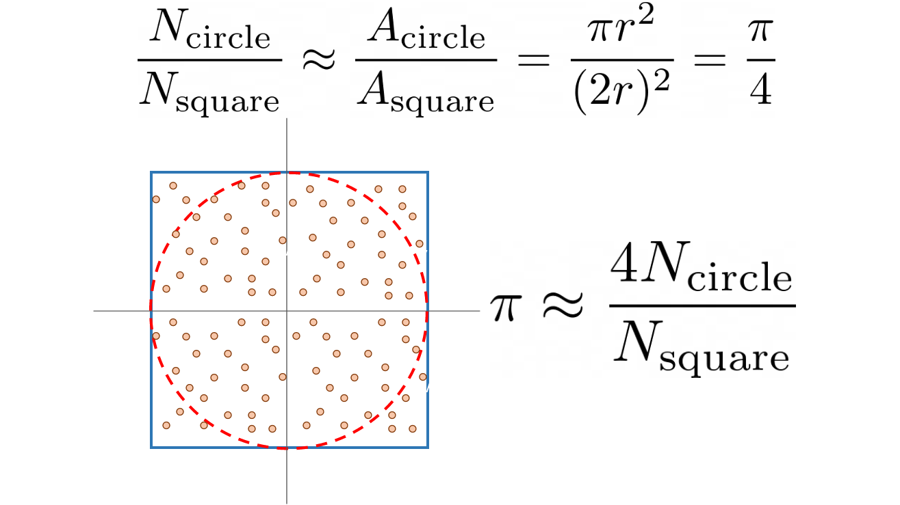
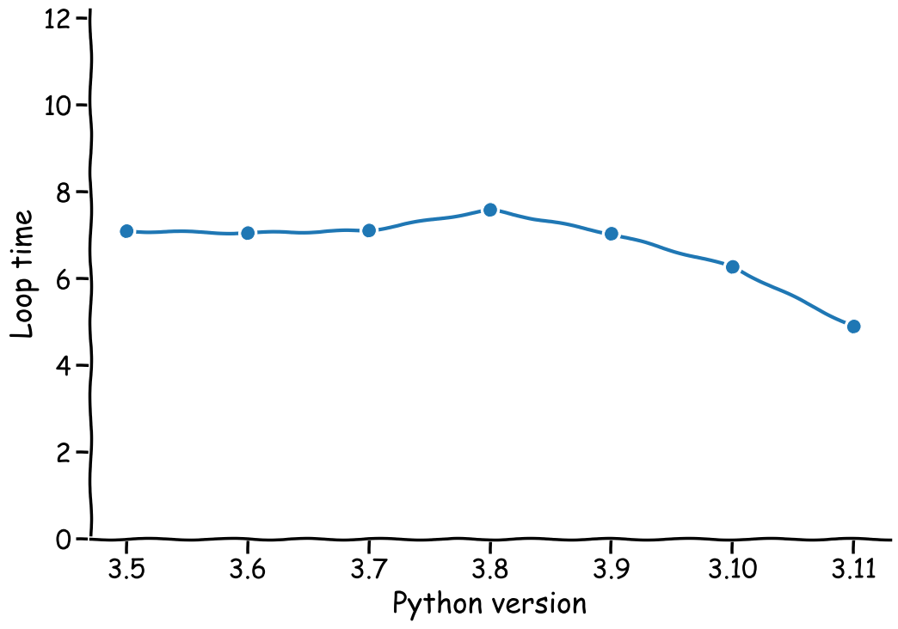

# Benchmarking the New and Impressive Python 3.11

Python is one of the most used scripting languages in data science (DS) and machine learning (ML). According to [PopularitY of Programming Languages](https://pypl.github.io/PYPL.html) Python is the most searched language on Google. Next to being a great glue language to connect various DS/ML solutions together, it has many libraries to virtually do anything with data.

In about a month we get a fresh new yearly release of Python: version 3.11. I am quite excited about this new version as the main feature for this version is a significant increase in speed.

On LinkedIn I have already seen a couple of post of people testing the new version and their results were stunning. But the best method to get a feeling on how fast Python 3.11 truly is, is to run the tests yourself.

Benchmarking a programming language is not trivial at all. When you read x is faster than y, you should always take the result with a grain of salt. One implementation of an algorithm can be better of x while another is better on y. For our benchmark it is a bit simpler as we are testing Python against Python, but we might have selected elements from the language that are only marginally effected. With this in mind, I want to present the algorithm I used to benchmark: the estimation of Pi using a Monte Carlo method.

The idea of this algorithm is simple but the first time a saw it during some mathematics course at the University it blew my mind. We have a square of size 2r and in this square we fit a circle of radius r. Now we take a random number generator that generates numbers on a plane: <-r, r>, <-r, r>. The ratio between the points that are on the circle and the points on the square (read: all points) is an approximation of the ratio of area, which we can use to approximate Pi. This is a bit more clear in the equation:


Figure 1: Derivation of the Monte Carlo method to estimate Pi. The ratio between the two areas is Pi/4, therefore, Pi is approximately 4 times N_circle / N_all. (image by author).

In Python, I have split up the actual estimation from a testing script such that I can repeat the test and take the average. Not shown here, but I have also parametrized the script using Argparse, a standard library to parse arguments from the command line interface (CLI)

This script is ready to run, however we want to use it to test various versions of Python, not only the currently installed (or activated) version. The easiest way to test multiple versions of Python is to use Docker. Python maintains many docker images. Naturally all supported version, but also some versions that are end-of-life (EOL) such as 2.7 or 3.2. It also has images for release candidates such as version 3.11. To use Docker, you need to have it installed. In Linux and Mac it is relatively easy, in Windows I am not so sure but probably not difficult as well. I would advice to install only the docker CLI, the desktop is too much bloat for me. To run a local script in a containerized Python environment run:

To automate the tests for the various version, we will of course also use Python. This script will simply start a subprocess to start a container with the particular Python version and collects the results afterwards.

When running these tests, the absolute number differs from machine to machine, depending on the processor (it is CPU heavy). Here are the results for the last 7 major Python versions:

```stdout
The new Python 3.11 took 4.891 seconds per run.

Python 3.5 took 7.089 seconds per run. (Python 3.11 is 44.9% faster)
Python 3.6 took 7.0434 seconds per run. (Python 3.11 is 44.0% faster)
Python 3.7 took 7.1027 seconds per run. (Python 3.11 is 45.2% faster)
Python 3.8 took 7.579 seconds per run. (Python 3.11 is 55.0% faster)
Python 3.9 took 7.0289 seconds per run. (Python 3.11 is 43.7% faster)
Python 3.10 took 6.0265 seconds per run. (Python 3.11 is 23.2% faster)
```




Disclaimer
While these benchmarks for Python 3.5 .. Python 3.11 are valid, the extrapolation is of course meant as a joke. The XKCD style figures are meant as an additional reminder to that ;-).